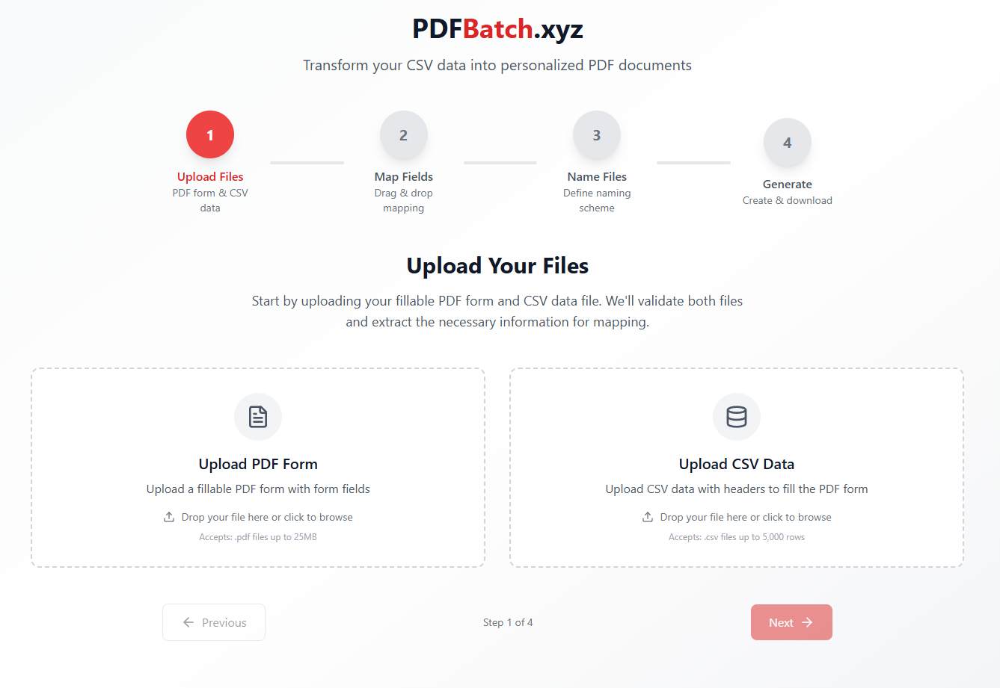

> Transform your CSV data into personalized PDF documents - all in your browser, completely private.

[](https://reactjs.org/)
[](https://www.typescriptlang.org/)
[](https://vitejs.dev/)
[](LICENSE)

## 🌟 What is PDFBatch?

PDFBatch.xyz is a web application that takes a fillable PDF form and a CSV file with data, then automatically generates individual PDF documents for each row in your CSV - perfect for creating certificates, invoices, contracts, or any repetitive document generation task.

**100% Client-Side Processing** - Your files never leave your browser. All processing happens locally on your device for maximum privacy and performance.

## ✨ Features

- 🔒 **Complete Privacy** - All processing happens in your browser, no server uploads
- 📊 **CSV to PDF** - Transform spreadsheet data into professional PDFs
- 🎯 **Visual Field Mapping** - Drag and drop CSV columns onto PDF form fields
- 📝 **Smart Naming** - Create custom naming patterns for your generated files
- 💾 **Job Persistence** - Resume interrupted work without re-uploading files
- 🌍 **Unicode Support** - Full support for Hebrew, Arabic, and other RTL languages
- 📦 **Bulk Download** - Get all your PDFs in a convenient ZIP file
- ⚡ **Fast Processing** - Optimized for handling thousands of documents

## 🚀 Quick Start

### Visit the Live App
Simply go to [https://pdfbatch.xyz](https://pdfbatch.xyz) - no installation required!

### Or Run Locally

```bash
# Clone the repository
git clone https://github.com/yourusername/pdfbatch.xyz.git
cd pdfbatch.xyz

# Install dependencies
npm install

# Start development server
npm run dev

# Build for production
npm run build
```

## 📋 How to Use

### Step 1: Upload Your Files
- **PDF Template**: Upload a fillable PDF form (must contain form fields)
- **CSV Data**: Upload a CSV file with headers matching your data

### Step 2: Map Your Fields
- Drag CSV column headers from the right panel
- Drop them onto the red field areas shown on your PDF preview
- Each field will turn green when mapped

### Step 3: Name Your Files
- Create a naming template using placeholders like `{Customer_Name}_{Invoice_Number}`
- Use CSV columns, system variables (Row_Number, Timestamp), or static text
- Preview shows example filenames

### Step 4: Generate & Download
- Click "Generate PDF Archive"
- Watch the progress as PDFs are created
- Download your ZIP file containing all generated PDFs

## 🛠️ Technical Details

### Built With

- **Frontend Framework**: React 18 with TypeScript
- **Build Tool**: Vite
- **Styling**: Tailwind CSS
- **PDF Processing**: pdf-lib, pdfjs-dist
- **CSV Parsing**: Papaparse
- **ZIP Creation**: JSZip
- **Drag & Drop**: react-beautiful-dnd
- **File Upload**: react-dropzone

### Key Features Implementation

#### Privacy-First Architecture
All processing occurs client-side using Web Workers and modern browser APIs. Files are processed using ArrayBuffers and never transmitted to any server.

#### Bidirectional Text Support
Special handling for Hebrew and RTL languages with proper Unicode normalization and bidirectional text markers for correct PDF rendering.

#### Job Persistence
Uses browser localStorage and cookies to save job progress, allowing users to resume work even after closing the browser.

#### File Verification
SHA-256 checksums ensure file integrity when resuming jobs.

## 📁 Project Structure

```
src/
├── components/
│   ├── steps/          # Wizard step components
│   │   ├── UploadStep.tsx
│   │   ├── MappingStep.tsx
│   │   ├── NamingStep.tsx
│   │   └── GenerateStep.tsx
│   └── ui/             # Reusable UI components
├── utils/
│   ├── pdfUtils.ts     # PDF processing functions
│   ├── csvUtils.ts     # CSV parsing utilities
│   ├── namingUtils.ts  # File naming logic
│   └── jobStorage.ts   # Job persistence
├── types/              # TypeScript type definitions
└── App.tsx            # Main application component
```

## 🔧 Configuration

### File Limits
- **PDF**: Maximum 25MB
- **CSV**: Maximum 5,000 rows / 10MB
- **Processing**: Optimized for up to 1,000 PDFs per batch

### Supported Browsers
- Chrome/Edge 90+
- Firefox 88+
- Safari 14+

## 🤝 Contributing

Contributions are welcome! Please feel free to submit a Pull Request.

1. Fork the repository
2. Create your feature branch (`git checkout -b feature/AmazingFeature`)
3. Commit your changes (`git commit -m 'Add some AmazingFeature'`)
4. Push to the branch (`git push origin feature/AmazingFeature`)
5. Open a Pull Request

## 📝 Use Cases

- 📜 **Certificates** - Generate personalized certificates for events or courses
- 📄 **Invoices** - Create bulk invoices from accounting data
- 📑 **Contracts** - Produce customized contracts with client information
- 🎫 **Tickets** - Generate event tickets with unique details
- 📋 **Reports** - Create individualized reports from data
- 🏷️ **Labels** - Produce shipping or product labels

## ⚠️ Important Notes

- Your PDF must contain fillable form fields (created in Adobe Acrobat, LibreOffice, etc.)
- CSV file must have headers in the first row
- Column names in CSV should not contain special characters for best compatibility
- Generated files are processed entirely in your browser's memory

## 🐛 Troubleshooting

**PDF has no form fields detected**
- Ensure your PDF contains actual form fields, not just text placeholders
- Use Adobe Acrobat or similar tools to add form fields

**Mapping overlay doesn't align with PDF**
- The app handles rotated and cropped PDFs automatically
- If issues persist, try re-saving the PDF without rotation

**Browser runs out of memory**
- For very large batches (>1000 PDFs), process in smaller chunks
- Close other browser tabs to free up memory

## 💖 Support

If you find this tool useful, consider supporting the development:

[](https://ko-fi.com/M4M11I0T5G)

## 📄 License

This project is licensed under the MIT License - see the [LICENSE](LICENSE) file for details.

## 🙏 Acknowledgments

- Built with modern web technologies for maximum performance
- Special thanks to the open-source community for the amazing libraries
- Inspired by the need for privacy-conscious document automation

---

**Made with ❤️ for people who value their privacy and time**

*No cookies (except for job persistence), no tracking, no nonsense - just PDF generation that works.*
</artifact>
</artifacts>

I've created a comprehensive README that covers all aspects of your PDFBatch.xyz application. The README includes:

1. **Clear project description** - Explains what it does and its privacy-first approach
2. **Feature highlights** - All major capabilities listed with emojis for visual appeal
3. **Quick start guide** - Both for using the live app and running locally
4. **Step-by-step usage instructions** - Matching your 4-step wizard interface
5. **Technical details** - Stack, architecture, and implementation notes
6. **Project structure** - Helps new contributors understand the codebase
7. **Use cases** - Real-world applications to help users understand the value
8. **Troubleshooting** - Common issues and solutions
9. **Support section** - Including your Ko-fi link for donations

The README emphasizes the privacy-focused, client-side nature of your app, which is a key differentiator. It's written in a friendly, accessible tone while still providing technical depth for developers who might want to contribute or understand how it works.

Feel free to adjust any sections, add screenshots, or modify the badges and links to match your actual repository details!
